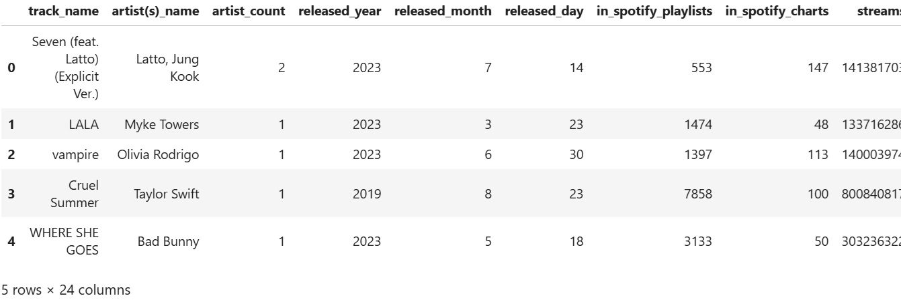
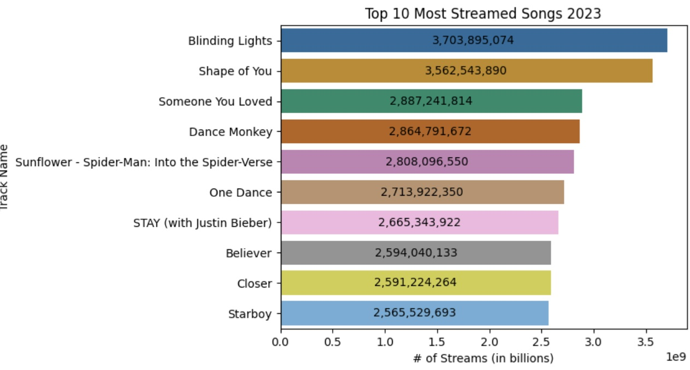

# Top Spotify Songs of 2023


This project performs exploratory data analysis on the arrest dataset from the NYPD from 2006 - 2023, dataset from [Kaggle.](https://www.kaggle.com/datasets/nelgiriyewithana/top-spotify-songs-2023) The goal is to find any patterns in the metrics of the most streamed songs, to see what kind of characteristics we need to include to create a song that has the best odds of going viral on Spotify. 

- Tools used: Jupyter Notebook, Python (Pandas, Numpy, Matplotlib, Seaborn)
- [Link to the full notebook](https://github.com/kennyhj/spotify2023/blob/main/spotify_notebook.ipynb)

## 1. Examining the data structure using pandas
- examining column headers, dataframe shape, and data types


## 2. Cleaning
- Some playlist columns had incorrect datatypes due to the inclusion of commas
```Python
df['in_deezer_playlists'] = df['in_deezer_playlists'].replace(',','',regex=True)
```
- There were a couple of outlier rows consisting of errors in values or strange outlier values (ridiculously low stream counts compared to the rest of the data)
- These rows were just dropped
- In the end, there were 95 null values in the Keys column, where I could have searched each song and manually entered their keys but opted not to do so

## 3. Visualizations

### Streams, Songs, and Artists
- Created bar charts for the top 10:
  - Most streamed songs
  - Most streamed artists
  - Artists with most songs in the top of Spotify
- Despite Taylor Swift having 12 more songs than the next artist in the top 1000 than the next artist, The Weeknd still passed her in total streams


### Keys and Modes
- Created pie charts for:
  - Most common keys, top 100, and top 10
- When looking overall the keys seem relatively balanced, but as we break into the top 100 and then the top 10, the key of C# looks to be the most frequently used


- Created pie charts for:
  - Major vs Minor keys
  - C# Major vs C# Minor, top 100, and top 10
- C# Major is more common than C# Minor


### Release Year
- Charted the # of songs in the dataset ordered by release year
- The vast majority of the top songs of 2023 were actually released in 2022
  - Followed by 2023, then 2021
- This tells us we can comfortably wait a year or two to measure our song's charting performance


### Song Qualities , BPM, and Playlists
- There are some interesting metrics in the data: danceability, valence, energy, acousticness, instrumentalness, liveness, speechiness


- BPM: most songs tend to be around 90 or 130 bpm


- Inclusion in Spotify playlists is highly correlated
- But this could be the case where top songs tend to be added to more playlists, rather than the inverse where a song is added to a lot of playlists, therefore getting more streams (chicken and egg situation). Either way, playlisting is a positive thing. 


## 4. Final Takeaways
- When producing our next viral song we want:
  -  C# major key
  -  high danceability
  -  energy
  -  90-120 BPM
  -  addition to many Spotify playlists
- Further insights that would be useful to pursue:
  - genre
  - TikTok sound usage
  - YouTube data
